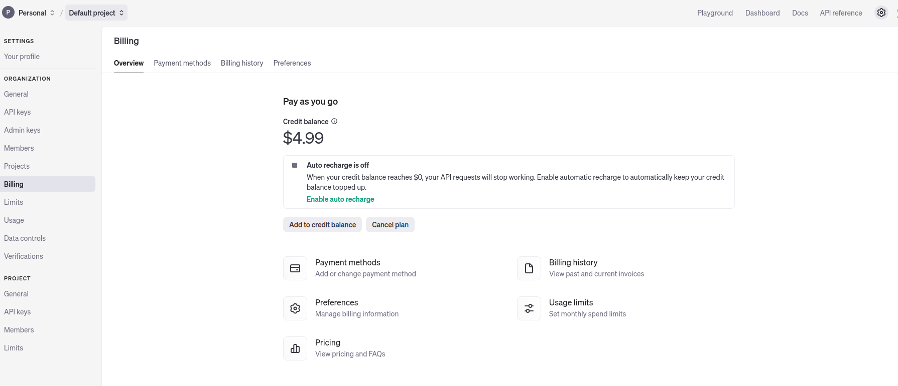

# Email Bot
## GENERAL

### Clone the repository:
```
   git clone https://github.com/ottipc/email-bot-express.git
   cd email-bot-express 
```


## BACKEND
This is a Node.js-based backend application that uses Express.js to create an email bot. The bot processes incoming emails via IMAP, generates replies using OpenAI's GPT models, and sends automated responses via SMTP.

---

## Features

- **IMAP Listener**: Monitors an email inbox for new messages and triggers processing.
- **OpenAI Integration**: Generates responses for incoming emails using GPT.
- **Email Sending**: Sends automated responses using the `nodemailer` library.
- **Database Integration**: Stores processed emails and their responses in MongoDB.
- **RESTful API**: Includes endpoints for email management (list, delete, etc.).

---

## Prerequisites

Ensure you have the following installed:

- **Node.js**: Version 16.x or higher.
- **MongoDB**: Locally or cloud-hosted instance.
- **IMAP-enabled Email Account**: To listen for incoming emails.
- **SMTP-enabled Email Account**: For sending responses.
- **OpenAI API Key**: To use GPT for generating email replies.

---

## Installation

### Clone the repository:
```
   git clone https://github.com/your-repo/email-bot-backend.git
   cd email-bot-backend
```

### Backend Structure
```
email-bot-backend/
│
├── src/
│   ├── controllers/          # Contains business logic for handling requests
│   ├── middlewares/          # Middleware for validation and error handling
│   ├── models/               # Mongoose schemas and models
│   ├── routes/               # Express.js routes
│   ├── services/             # External services (IMAP, OpenAI, SMTP)
│   ├── emailListener.js      # IMAP listener to process incoming emails
│   ├── sendEmail.js          # Utility to send emails via SMTP
│   └── app.js                # Express.js application entry point
│   
├── .env                      # Environment configuration
├── package.json              # Node.js dependencies and scripts
└── README.md
```

### API ENDPOINTS

#### 1. Generate Email Reply

**- POST /api/email/generate-email-reply**<br><br>
***Description:*** Generates an automated reply for an incoming email.<br><br>
***Request Body:***
```json
{
    "subject": "Subject of the incoming email",
    "body": "Body of the incoming email",
    "sender": "Sender's email address"
}
```

***Response:***
```json
{
  "reply_subject": "Re: Subject of the incoming email",
  "reply_body": "Automated response generated by GPT"
}
```
<br>

#### 2. List Emails

**- GET /api/emails**<br><br>
***Description:*** Retrieves all stored emails and their replies.<br><br>


#### 3. Delete Email

**- DELETE /api/email/:id**<br><br>
***Description:*** Deletes an email by its ID.<br><br>

### ENVIRONMENT VARIABLES
```
# Server Port
PORT=3000
# MongoDB URI (lokale Entwicklung)
MONGODB_URI=mongodb://localhost:27017/email-bot-express
# Falls MongoDB Atlas genutzt wird
# MONGODB_URI=mongodb+srv://<username>:<password>@cluster0.mongodb.net/emailsDB?retryWrites=true&w=majority
# JWT Secret Key
JWT_SECRET=your_jwt_secret_key
# OpenAI API Key
OPENAI_API_KEY=your_openai_key
# Node.js Umgebung
NODE_ENV=development
EMAIL_USER=o.t.5@gmx.de
EMAIL_PASSWORD=!gOA0pr#wsDh@iz6
IMAP_SERVER=imap.gmx.net
SMTP_SERVER=mail.gmx.net
SMTP_PORT=587
GPT_PROMPT="You are a professional email assistant. Your job is to:\n-Do not insert any Name after the greeting, because the Name is in the signature but insert a comma after the greeting at the end! That is important\n-Analyze the following email and understand the context and the request.\n-The Response has to be in the same language as the original Email.\n-The Greeting at the end has to be in the same language as the original Email\n-Write a professional response that addresses the request precisely, friendly and individually.\nThe response must not give any indication that it was automatically generated.\n- Automatically adapt the salutation to the name and polite form of the original email\n(e.g. 'Dear Mr. [Name]', 'Dear Ms. [Name]' or 'Hello [First Name]', depending on the tone of the original email).\nIf no name is given, start with 'Good day'.(of course in original language of the original email, this is important!) \n- Nothing may be changed or omitted from the signature. Use exactly the following signature in a light gray color (only the language have to be adjusted), separated by the line of stars as a divider before the signature:"
# Email Signature
EMAIL_SIGNATURE=YOUR SIGNATURE
```

### Running Tests

**1. Installing testing dependencies**
```bash
npm install --save-dev jest supertest
```

**2. Run tests**
```bash
npm test
```


### Licence

**This project is licensed under the MIT License. See the ***LICENSE*** file for details.**

### Contributing
Feel free to submit issues or pull requests to enhance this project.

### Author

Ottavio Braun [Find me on Github](https://github.com/ottipc)

**starten des Backends :** 

npm start -> Server running on port 3000

**starten des Frontends:**

npm run serve


**ChatGPT API Billing:**

https://platform.openai.com/settings/organization/billing/overview


**Test Call ob die Api ueberhaupt funktioniert:**

```
curl https://api.openai.com/v1/chat/completions \
-H "Authorization: Bearer YOUR_API_KEY" \
-H "Content-Type: application/json" \
-d '{
"model": "gpt-3.5-turbo",
"messages": [{"role": "user", "content": "Hello, ChatGPT!"}],
"max_tokens": 50
}'
```


**API Schluessel testen:**

```
curl https://api.openai.com/v1/models \
-H "Authorization: Bearer YOUR_API_KEY"
```

**ChatGPT sollte zeigen:**


## Docker

### Get sure Docker user can work
```
sudo chown -R $(id -u):$(id -g) ./express-backend ./vue-frontend
```
```
docker-compose build
docker-compose up -d
```

### Frontend in Docker  : 
http://localhost:8090/

### Backend in Docker  : 
http://localhost:3000/

Renove Volume :  docker volume rm mongodb-data
Remove Conteiner : docker-compose down

### Logs 

docker logs backend-service


